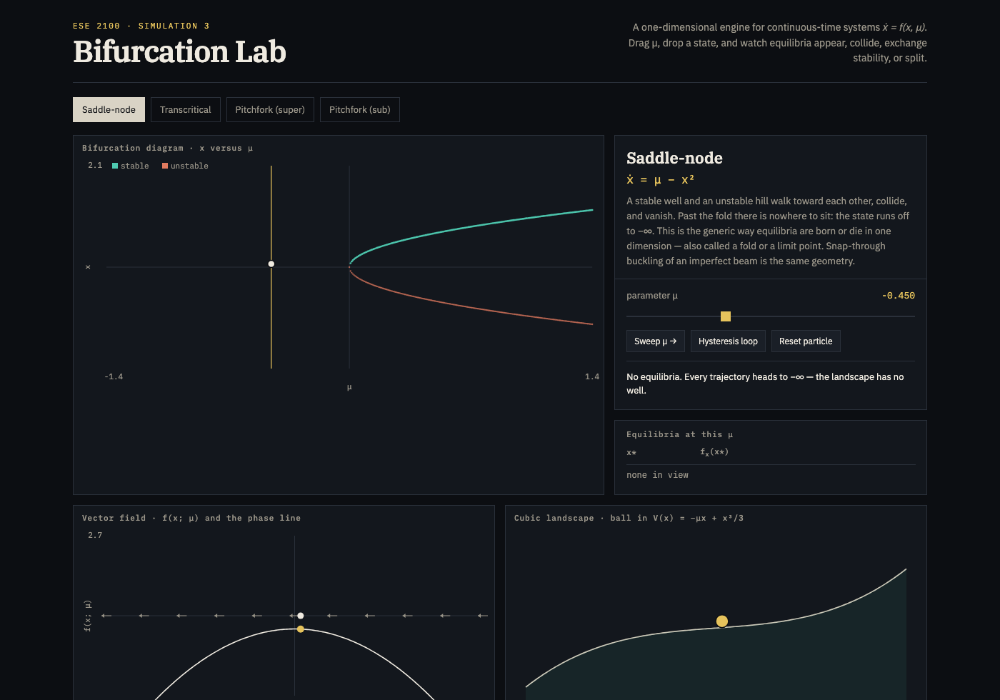
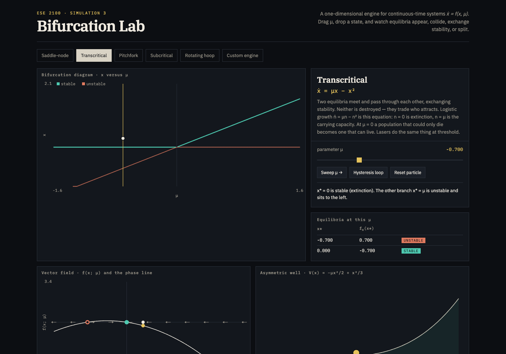
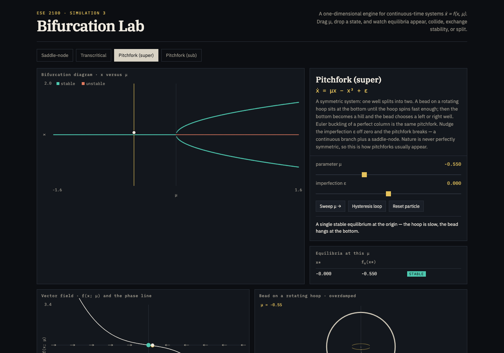
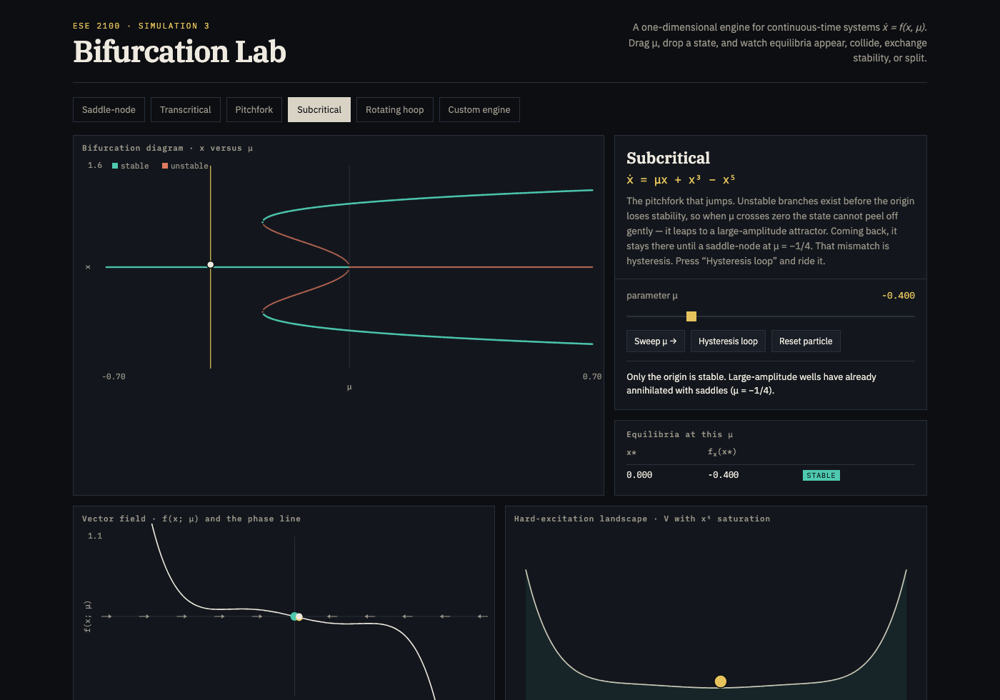

# ESE 2100 · Simulation 3 — Bifurcation Lab

A 1-D visualization of \(\dot x = f(x,\mu)\) with exactly four bifurcations:

1. Saddle-node
2. Transcritical
3. Pitchfork (supercritical)
4. Pitchfork (subcritical)

**Live page:** [markomij12.github.io/ese2100-bifurcation-lab](https://markomij12.github.io/ese2100-bifurcation-lab/)

Repo: [github.com/markomij12/ese2100-bifurcation-lab](https://github.com/markomij12/ese2100-bifurcation-lab). Or open `index.html` locally — no install.

## The four systems

The phase space is a line, so these are the generic bifurcations of equilibria. Hopf needs a 2-D phase plane and is out of scope.

| Tab | Equation | What happens |
|---|---|---|
| Saddle-node | \(\dot x = \mu - x^2\) | A stable and an unstable equilibrium collide and vanish |
| Transcritical | \(\dot x = \mu x - x^2\) | Two branches cross and **exchange** stability |
| Pitchfork (super) | \(\dot x = \mu x - x^3 + \varepsilon\) | One well splits into two continuously (\(\varepsilon=0\) is the perfect case) |
| Pitchfork (sub) | \(\dot x = \mu x + x^3 - x^5\) | The origin loses stability by a jump; hysteresis on the way back |

The engine finds equilibria by Newton on a grid, classifies them by \(\mathrm{sign}(f_x)\), and integrates a particle with RK4.

## How to use it

1. Pick one of the four systems in the top row.
2. Drag **μ**. The gold line is the slice you are on.
3. Click the vector-field plot (or the diagram) to drop a particle.
4. **Sweep μ →** walks the parameter. **Hysteresis loop** is meant for Pitchfork (sub).
5. On Pitchfork (super), **ε** is an optional imperfection: at \(\varepsilon=0\) you get the textbook pitchfork; off zero it unfolds into a smooth branch plus a saddle-node.

Keyboard: ← → nudge μ, space toggles the sweep. Teal = attracting, coral = repelling.

## What to look for

**Saddle-node.** Start at μ < 0: no equilibria, the ball runs off the cubic landscape. Cross μ = 0 and a well appears from nothing. That is how equilibria are born in 1-D.

**Transcritical.** Watch the two branches actually pass through each other. Extinction \(x=0\) and the carrying capacity \(x=\mu\) swap who is stable. Neither branch is destroyed.

**Pitchfork (super).** At ε = 0 one well splits into two continuously. Nudge ε and the diagram breaks: one side is preferred through μ = 0, the other is born in a saddle-node.

**Pitchfork (sub).** Sit near the origin, sweep μ up through 0: jump. Sweep back: you do not return until μ = −1/4. History matters. Press **Hysteresis loop**.

## Files

- `index.html` — the lab (HTML + CSS + canvas)
- `docs/` — screenshots of the four systems
