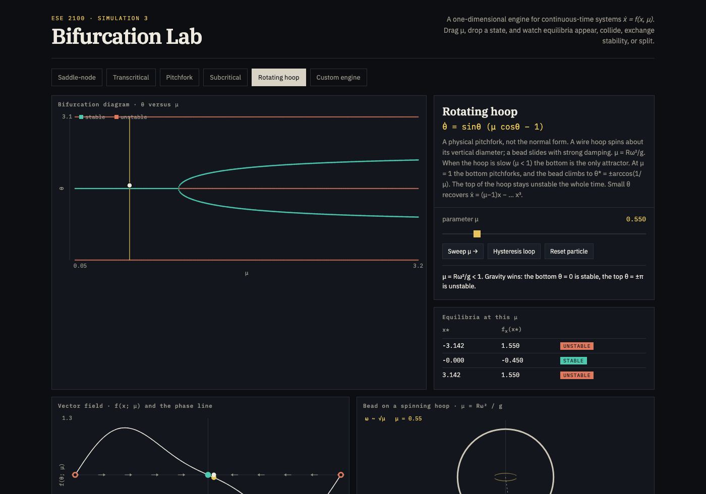

# ESE 2100 · Simulation 3 — Bifurcation Lab

Interactive 1-D visualization for continuous-time systems \(\dot x = f(x,\mu)\).

**Live page:** open [`index.html`](index.html) in a browser, or the public URL once GitHub Pages is up.

No install. One file.

## What this is

A single-parameter family of scalar ODEs. The phase space is a line, so the only generic bifurcations of equilibria are saddle-node, transcritical, and pitchfork (super- and subcritical). Hopf needs a 2-D phase plane; this lab stays in one dimension on purpose.

| System | Equation | What happens |
|---|---|---|
| Saddle-node | \(\dot x = \mu - x^2\) | A stable and an unstable equilibrium collide and vanish |
| Transcritical | \(\dot x = \mu x - x^2\) | Two branches cross and **exchange** stability |
| Pitchfork | \(\dot x = \mu x - x^3 + \varepsilon\) | One well splits into two; \(\varepsilon\) unfolds it |
| Subcritical | \(\dot x = \mu x + x^3 - x^5\) | Jump off the origin, plus hysteresis |
| Rotating hoop | \(\dot\theta = \sin\theta\,(\mu\cos\theta - 1)\) | Physical pitchfork, \(\mu = R\omega^2/g\) |

The engine finds equilibria by Newton on a grid, classifies them by \(\mathrm{sign}(f_x)\), and integrates a particle with RK4. Custom `f(x, mu)` is allowed.

## How to use it

1. Pick a system in the top row.
2. Drag **μ**. The gold line is the slice you are on.
3. Click the vector-field plot (or the diagram) to drop a particle.
4. **Sweep μ →** walks the parameter; **Hysteresis loop** is the one to press on the subcritical system.
5. On **Pitchfork**, drag **ε** off zero. The perfect pitchfork breaks into a smooth branch plus a saddle-node — the usual laboratory picture.
6. **Rotating hoop** is the physical analog: a bead on a wire hoop spinning about its vertical diameter, overdamped.
7. **Custom engine** accepts JavaScript (`mu - sin(x)` is an overdamped pendulum with torque; saddle-nodes at \(\mu = \pm 1\)).

Keyboard: ← → nudge μ, space toggles the sweep.

## What to look for

**Saddle-node.** Start at μ < 0: no equilibria, the ball runs off the cubic landscape. Cross μ = 0 and a well appears from nothing. That is how equilibria are born in 1-D. Snap-through buckling of an imperfect beam is the same fold.

**Transcritical.** Watch the two branches actually pass through each other. Extinction \(x=0\) and the carrying capacity \(x=\mu\) swap who is stable. This is the awkward one to build with magnets and springs: the rest points have to collide and keep going rather than glance off as a fold. A laser at threshold is the same exchange.

**Pitchfork + ε.** At ε = 0 the hoop (or a perfect column) is symmetric. Nudge ε and the diagram *breaks* — one side is preferred all the way through μ = 0, the other is born in a saddle-node. Real buckling looks like this.

**Subcritical.** Sit near the origin, sweep μ up through 0: jump. Sweep back: you do not return until μ = −1/4. History matters. Press **Hysteresis loop**.

**Rotating hoop.** Slow spin: bead at the bottom. At μ = 1 the bottom pitchforks and the bead climbs to \(\theta^* = \pm\arccos(1/\mu)\). Small θ recovers the pitchfork normal form.

## Files

- `index.html` — the lab (HTML + CSS + canvas). Fonts from Google; everything else is local.
- `docs/` — screenshots of each system, for a PDF writeup if a link is not enough.
